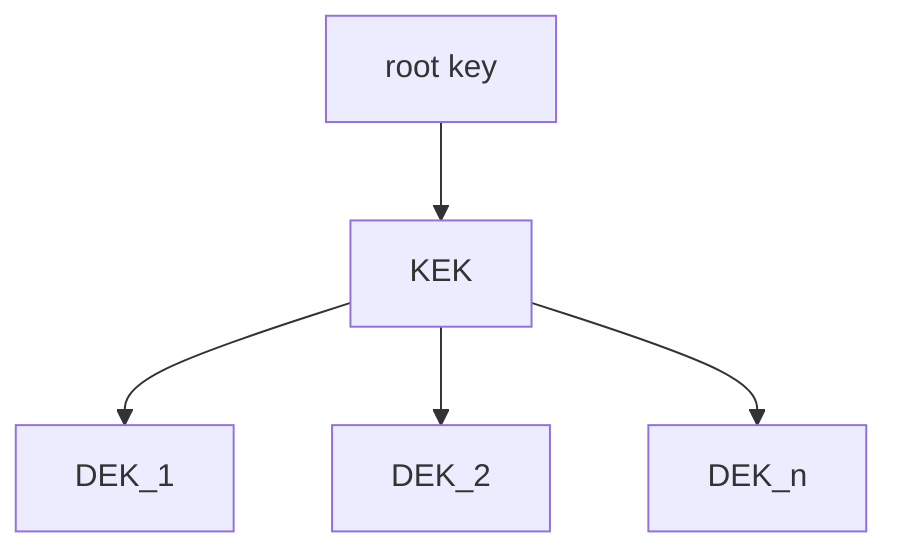

# KMS-proxy

Encrypts data with a key chain. The key chain is one or more AES-128bit keys.
There is only one primary key, which is used for encryption. Depending on the
prefix, older keys are used from the keychain. The key chain needs to be stored.

This key chain can be used as a KMS-plugin. Instead of a KMS-provider an HMS can
be used.

There are different storage options:

- store along every ciphertext and
- store in "etcd".

## Why

The goal is to **call a KMS-provider less often**. By adding an additional key-
layer, the calls to a KMS-provider can be reduced by up to 2^21 calls.

This can be highly beneficial, as every call to a KMS-provider generates costs.
The costs could be monetary or temporary.

## Next

1. Hook up KMS.
1. Hook up PKCS #11.
1. Hook up passphrase.

## Details

### Naming

- **root key** is an external key that encrypts the key chain
- **key chain** is a **KEK** and a counter that limits the usage to secure defaults
- **KEK** is a set of keys with one key being the primary key.
- **DEK** is a key used once for encryption of data.
- **ciphertext** is data that got encrypted.
- **encrypted data** is the ciphertext and the DEK.

### Key Hierarchy



Data is encrypted with an individual key, called data encryption key (DEK). The
DEKs are encrypted with a key encryption key (KEK). The KEK is encrypted with a
root key that comes from the KMS-provider, HMS or passphrase.

The encrypted DEK is stored alongside the encrypted data and cached in memory.

The encrypted KEK is stored is stored, where configured.

### Encryption

The encryption algorithm is AES, in GCM mode with a 128 bit key. 128 bit key
should be enough. Impossible is impossible*. A good key hygiene is more improtant.

The KEK rotates when necessary automatically to keep the data safe.

\* Until we have quantum-computing on the same level as we have
  non-quantum-computing. As it can compute like 
  [the key size would be cut in half](https://en.wikipedia.org/wiki/Grover%27s_algorithm#Cryptography).

## Usage

Start anew:

```Go
keyChain, err := kms.New()
if err != nil {
  return err
}

// encryptedData and not cipher text as it contains encrypted DEK
encryptedData, err := keyChain.Encrypt([]byte(plaintext))
if err != nil {
  return err
}

plainTextAsBytes, err := keyChain.Decrypt(encryptedData)
if err != nil {
  return err
}

if !bytes.Equal([]byte(plaintext), plainTextAsBytes) {
  panic(errors.New("PRs are welcome!"))
}
```

Start from `io.Reader`:

```Go
// TODO
```

Start from `external_kms`:

```Go
// TODO
```

Start from `hms`:

```Go
// TODO
```
