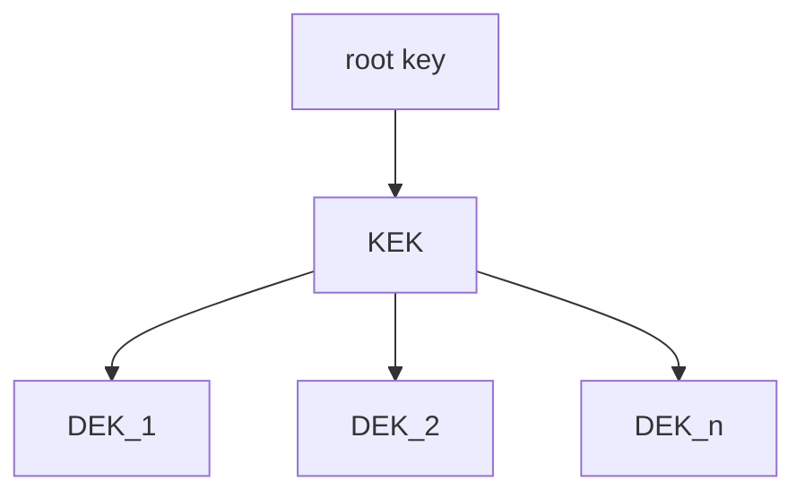

# intermediate-kms

Encrypts data with individual keys (128 bit) with AES GCM. The "main key" needs
to be encrypted. The options should be a KMS-provider, a PKCS #11 HMS or a
passphrase.

## Why

The goal is to **call a KMS-provider once** and spawn sub-keys. As every call to
a KMS-provider generates costs. The costs could be monetary or by running into
throttling.

## Next

1. Hook up KMS.
2. Hook up PKCS #11.
3. Hook up passphrase.

## Details

### Naming

- **root key** is an external key that encrypts the key chain
- **key chain** is the combination of the **KEK** and a cache of **DEKs**
- **KEK** is a set of keys with one set as primary.
- **DEK** is a key used once for encryption of data.
- **ciphertext** is data that got encrypted.
- **encrypted data** is the ciphertext and the DEK.

### Key Hierarchy



Data is encrypted with an individual key, called data encryption key (DEK). The
DEKs are encrypted with a key encryption key (KEK). The KEK is encrypted with a
root key that comes from the KMS-provider, HMS or passphrase.

The encrypted DEK is stored alongside the encrypted data and cached in memory.

The encrypted KEK is stored is stored, where configured.

### Encrypted data

The encrypted data is a [gob](https://pkg.go.dev/encoding/gob) encoded like so:

```Go
type EncryptedData struct {
  Ciphertext   []byte
  EncryptedDEK []byte
}
```

It is better then `[]byte` slicing.

### Encryption

The encryption algorithm is AES, in GCM mode with a 128 bit key. 128 bit key
should be enough. Impossible is impossible*. A good key hygiene is more improtant.

The KEK rotates when necessary automatically to keep the data safe.

\* Until we have quantum-computing on the same level as we have
  non-quantum-computing. As it can compute like 
  [the key size would be cut in half](https://en.wikipedia.org/wiki/Grover%27s_algorithm#Cryptography).
## Usage

Start anew:

```Go
keyChain, err := kms.New()
if err != nil {
  return err
}

// encryptedData and not cipher text as it contains encrypted DEK
encryptedData, err := keyChain.Encrypt([]byte(plaintext))
if err != nil {
  return err
}

plainTextAsBytes, err := keyChain.Decrypt(encryptedData)
if err != nil {
  return err
}

if !bytes.Equal([]byte(plaintext), plainTextAsBytes) {
  panic(errors.New("PRs are welcome!"))
}
```

Start from `io.Reader`:

```Go
// TODO
```

Start from `external_kms`:

```Go
// TODO
```

Start from `hms`:

```Go
// TODO
```
