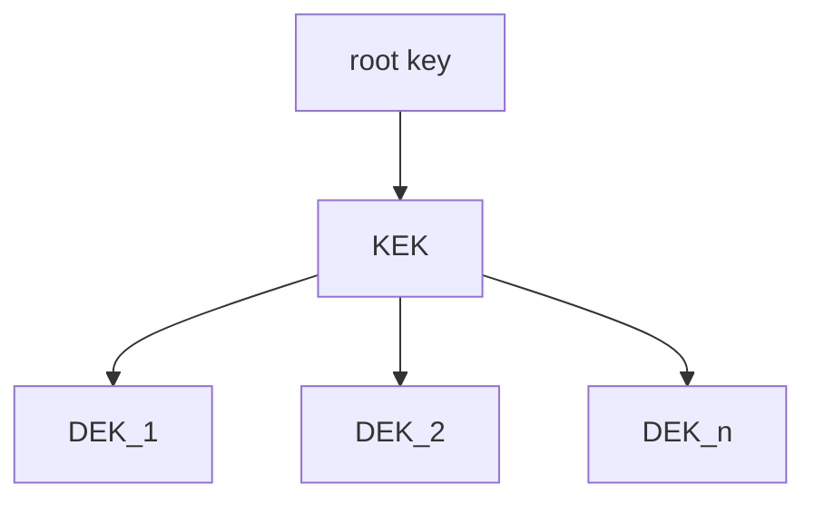

# intermediate-kms

Encrypts data with individual keys (128 bit) with AES GCM. The "main key" needs
to be encrypted. The options should be a KMS-provider, a PKCS #11 HMS or a
passphrase.

## Why

The goal is to **call a KMS-provider once** and spawn sub-keys. As every call to
a KMS-provider generates costs. The costs could be monetary or by running into
throttling.

## Details



Data is encrypted with an individual key, called data encryption key (DEK). The
DEKs are encrypted with a key encryption key (KEK). The KEK is encrypted with a
root key that comes from the KMS-provider, HMS or passphrase.

The encrypted DEK is stored alongside the encrypted data.

The encrypted KEK is stored is stored, where configured.

### Encryption

The encryption algorithm is AES, in GCM mode with a 128 bit key. 128 bit key
should be enough. Impossible is impossible. A good key hygiene is more improtant.

The KEK rotates when necessary automatically to keep the data safe.

## Usage

```Go
type EncryptedData struct {
    Nonce []byte
    EncryptedKey []byte
    CipherText []byte
}
```

### As library

```Go
func New(
    // where to write KEK
    store io.Writer,
)
```

```Go
// src is the file that gets encrypted. out is the encrypted blob.
func (k KEK) Encrypt(src []byte) (out []byte, err error)
// src is the file that gets decrypted. out is the encrypted blob.
func (k KEK) Decrypt(src []byte) (out []byte, err error)
```

